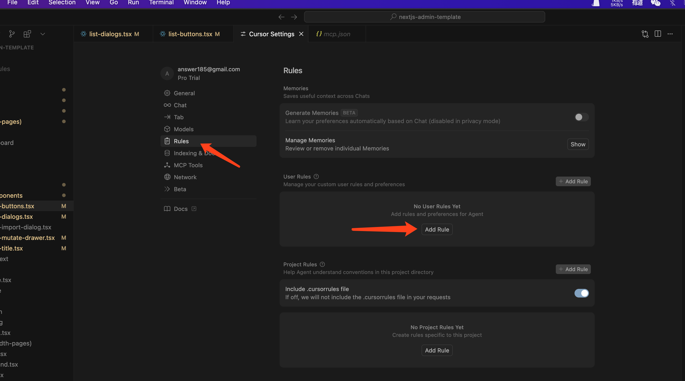
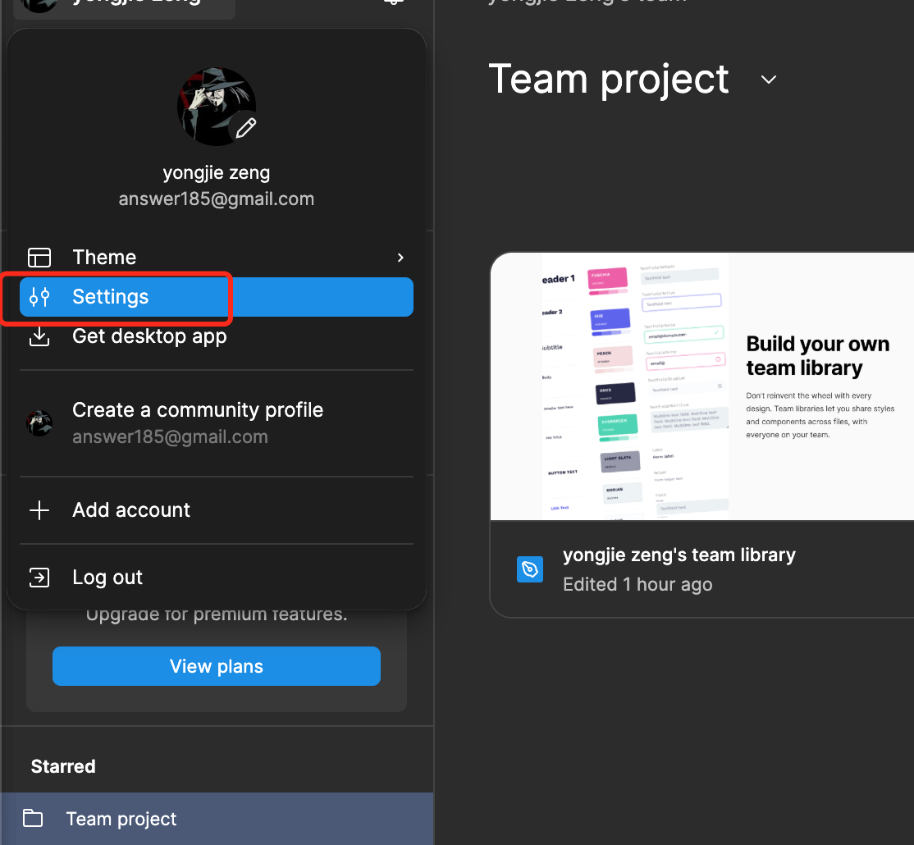
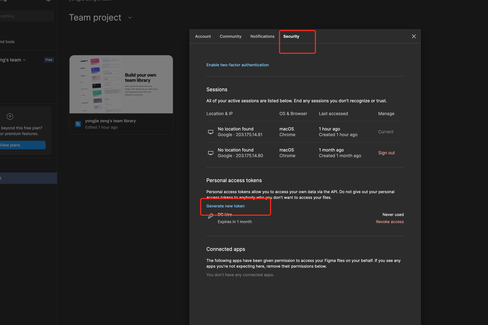
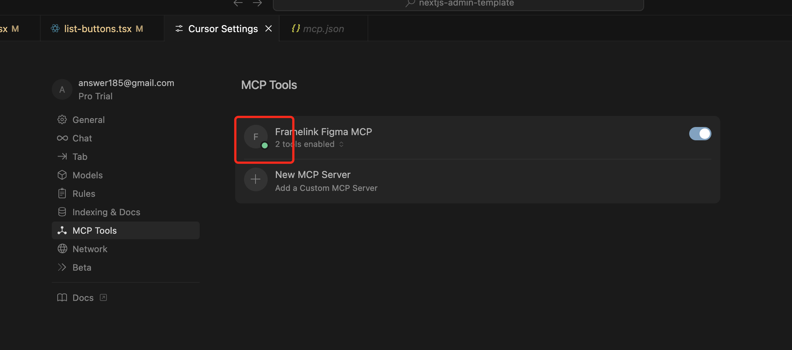

# Cursor Usage

This article mainly targets Cursor 1.0

## What is it
An AI code editor with main features including:
- Predict your next edits based on context, making modifications easy to complete.
- Get answers from codebase or documentation, with specific file references. Apply model-generated code with one click.
- Generate corresponding code using natural language.

## Basic Usage
### Common Shortcut Functions
1. Tab: Auto-completion
2. Ctrl/Command+K: Edit code
3. Ctrl/Command+L: Answer user questions about code and entire projects, can also edit code (most comprehensive functionality)
4. Ctrl/Command+I: Edit entire project code (cross-file code editing)

### Replacing Code
After modifying code, if there are no issues, click Accept or command +Y to accept the changes.

### Setting AI Rules
Pre-configure some prompts for AI to make responses more professional.


## Figma Design Initialization
Figma designs can be integrated with Cursor. After configuring MCP service, you can quickly generate corresponding static pages. Specific steps are:
- Create an API token on Figma


- Then start an MCP service locally
```
pnpx figma-developer-mcp --figma-api-key=API_KEY
```
Note: Node version must be > 20
- Set corresponding MCP service in Cursor settings
Write corresponding JSON configuration
```json
{
  "mcpServers": {
    "Framelink Figma MCP": {
      "command": "npx",
      "args": ["-y", "figma-developer-mcp", "--figma-api-key=API_KEY", "--stdio"]
    }
  }
}
```
After successful configuration, status will turn green

- Copy the corresponding design link on Figma
- In Cursor's chat window, add corresponding generation instructions, such as:
```
@https://www.figma.com/design/HmaPnvgv3f40RbwR4rL8fH/yongjie-zeng-s-team-library?node-id=1-2&t=qhVrTAVfvWDn6R9J-4  Help me implement the content in this design using this project's tech stack
```

## Quick UI Component Generation
If there's no design, you can also develop one based on functionality and component libraries first, such as:
```
Based on shadcn/ui and react-hook-form, create a user login form including:
- Email input (required + format validation)
- Password input (required + minimum length 6)
- Submit button
Use Zod for validation, display form errors below corresponding fields.
```
Will generate basic code for the corresponding tech stack.

## Code Debugging and Fixing
When encountering errors, directly input the corresponding error report, and it will provide more precise solutions based on the project environment.
For example, when encountering SSR error "FileList is not defined", open the corresponding file and ask:
This code will report error "FileList is not defined" in Next.js SSR, how to modify it to be compatible with server-side rendering?
Cursor will provide corresponding optimized code (using z.any() instead of z.instanceof).

## Business Logic Code Generation
Clearly explain the corresponding business logic and create instructions, Cursor will generate corresponding functions as required.

## Unit Test Code Generation
Directly request generation of corresponding test code for a component, such as:
Generate Vitest test code for the following shadcn/ui button component, covering click events and props passing:
Cursor will output:
```js
import { render, screen, fireEvent } from "@testing-library/react"
import { describe, it, expect, vi } from "vitest"
import MyButton from "./MyButton"

describe("MyButton", () => {
  it("renders children correctly", () => {
    render(<MyButton>Click me</MyButton>)
    expect(screen.getByText("Click me")).toBeInTheDocument()
  })

  it("triggers onClick", () => {
    const mockClick = vi.fn()
    render(<MyButton onClick={mockClick}>Test</MyButton>)
    fireEvent.click(screen.getByRole("button"))
    expect(mockClick).toHaveBeenCalled()
  })
})
```

## Summary
Cursor can participate in almost all aspects of project development. The above only lists core scenarios, others include:
- Generate component documentation
- Detect non-standard code
- Find code bugs
- Find potentially performance-problematic code
- Detect duplicate code and provide optimization solutions
