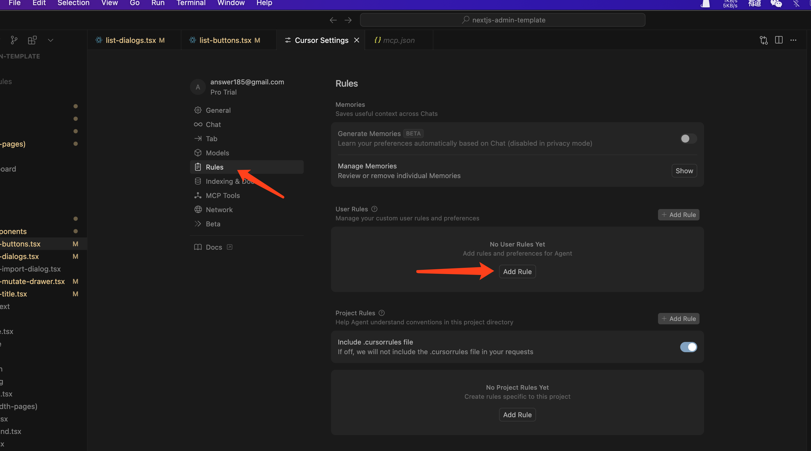
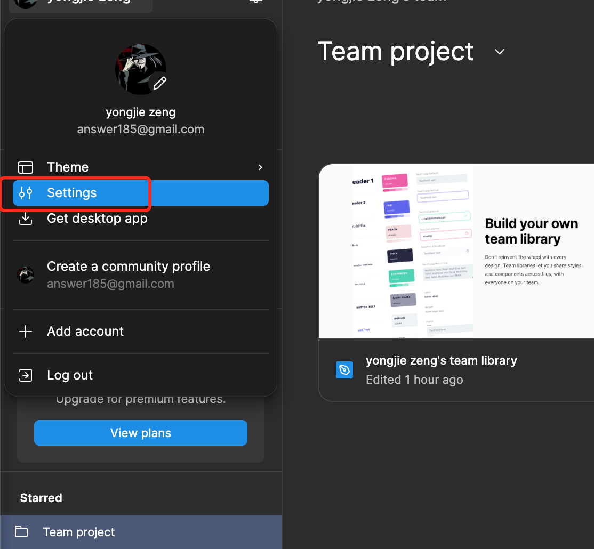
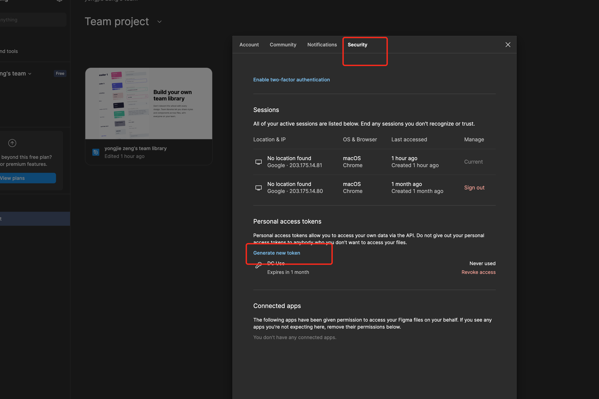
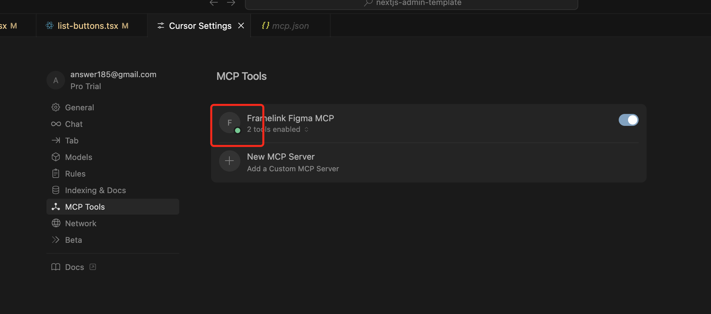

# cursor使用
文章主要针对cursor 1.0
## 是什么
是一款AI 代码编辑器，主要的功能有：
- 根据上下文预测你的下一步编辑，让你轻松完成修改。
- 从代码库或文档中获取答案，还能引用具体文件。 一键即可应用模型生成的代码。
- 使用自然语言生成相应的代码。

## 基础使用
### 常用快捷功能
1. Tab：自动填充
2. Ctrl/Command+K：编辑代码
3. Ctrl/Command+L：回答用户关于代码和整个项目的问题，也可以编辑代码（功能最全面）
4. Ctrl/Command+I：编辑整个项目代码（跨文件编辑代码）

### 替换代码
修改好代码后，如果没有问题，点击Accept 或 command +Y，接受修改即可。

### 设置AI规则
为AI预置一些提示，使其回答更专业。

## Figma设计稿初始化
Figma的设计稿可以与cursor做对接，在配置好MCP服务后，可以快速生成相应的静态页面，具体步骤如下：
- 在figma上创建一个api token


- 然后在本地启动一个MCP服务
```
pnpx figma-developer-mcp --figma-api-key=API_KEY
```
这里需要注意，Node版本必须 > 20
- 在cursor设置上设置相应的CMP服务
写入相应的json配置
```json
{
  "mcpServers": {
    "Framelink Figma MCP": {
      "command": "npx",
      "args": ["-y", "figma-developer-mcp", "--figma-api-key=API_KEY", "--stdio"]
    }
  }
}
```
配置成功后，会状态会变成绿点

- 在figma上复制相应设计稿的链接
- cursor的聊天窗口里，添加相应的生成指令，如：
```
@https://www.figma.com/design/HmaPnvgv3f40RbwR4rL8fH/yongjie-zeng-s-team-library?node-id=1-2&t=qhVrTAVfvWDn6R9J-4  帮我使用这个项目的技术栈实现这个设计稿中的内容
```
## 快速生成 UI 组件
如果没有设计稿，也可以基于功能及组件库先开发一个，如
```
基于 shadcn/ui 和 react-hook-form，创建一个用户登录表单，包含：
- 邮箱输入（必填+格式校验）
- 密码输入（必填+最小长度6）
- 提交按钮
使用 Zod 做校验，表单错误显示在对应字段下方。
```
会生成相应技术栈的基础代码。
## 代码调试与修复
遇到错误时，直接输入相应的错误报告，它会根据项目环境，更精准给出解决方案。
比如遇到： FileList is not defined 的 SSR 错误时，打开相应的文件，并提问
这段代码在 Next.js SSR 会报错 "FileList is not defined"，如何修改使其兼容服务端渲染？
Cursor 会提供相应的优化代码（用 z.any() 替代 z.instanceof）。

## 业务逻辑代码生成
把相应的业务逻辑说明清楚，作成指令，cursor会按要求，生成相应的函数。
## 单元测试代码生成
直接要求对某个组件生成相应的测试代码，如：
为以下 shadcn/ui 按钮组件生成 Vitest 测试代码，覆盖点击事件和props传递：
cursor会输出：
```js
import { render, screen, fireEvent } from "@testing-library/react"
import { describe, it, expect, vi } from "vitest"
import MyButton from "./MyButton"

describe("MyButton", () => {
  it("renders children correctly", () => {
    render(<MyButton>Click me</MyButton>)
    expect(screen.getByText("Click me")).toBeInTheDocument()
  })

  it("triggers onClick", () => {
    const mockClick = vi.fn()
    render(<MyButton onClick={mockClick}>Test</MyButton>)
    fireEvent.click(screen.getByRole("button"))
    expect(mockClick).toHaveBeenCalled()
  })
})
```
## 总结
cursor几乎可以参与到项目开发的各种环节，上面只是列出核心的场景，其他的还有：
- 生成组件文档
- 检测不规范的代码
- 寻找代码Bug
- 寻找可能有性能问题的代码
- 对重复代码进行检测，并提供优化方案
