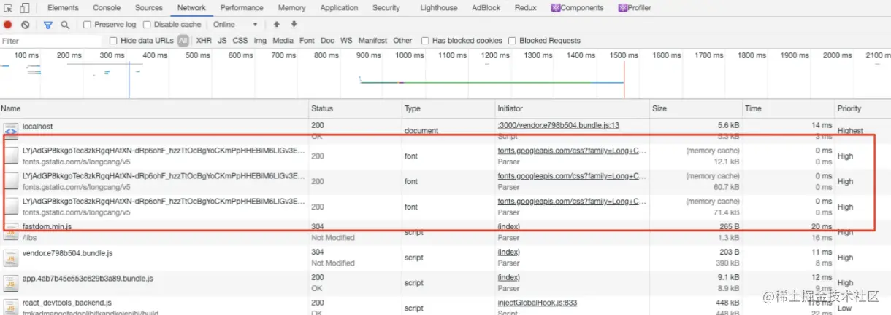
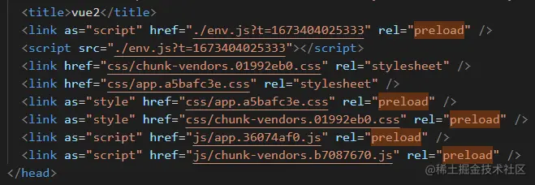
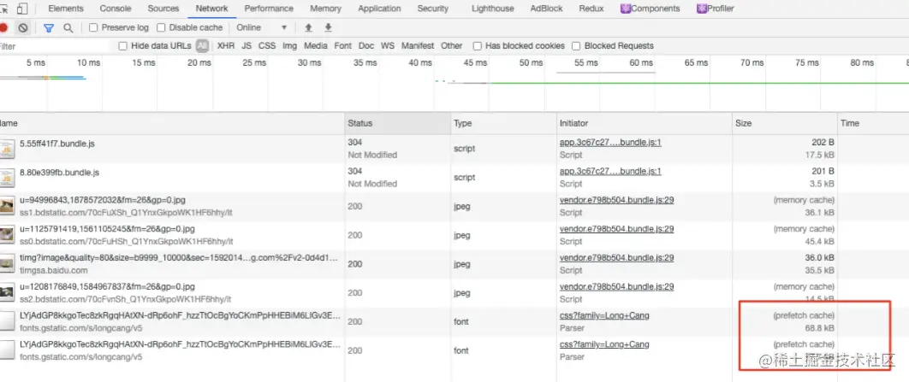

# 6 Ways of JS Loading

## I. Script Tags
### 1.1 Normal Mode
```html
<script src="index.js"></script>
```
In this case, JS will block DOM rendering, and the browser must wait for index.js to load and execute before doing other things.

If there are multiple files, they will be loaded and executed in the order they appear in the document.

### 1.2 async Mode
```html
<script async src="index.js"></script>
```
In async mode, loading is asynchronous, JS won't block DOM rendering, async loading is unordered, and when loading is complete, JS will execute immediately.
If there are multiple tags, they are loaded in parallel asynchronously.

Use cases: When the JS resource has no dependency relationship with DOM elements and doesn't generate data needed by other resources, async mode can be used, such as tracking statistics, advertisements, libraries that don't depend on other scripts, etc.

### 1.3 defer Mode
```html
<script defer src="index.js"></script>
```
In defer mode, JS loading is also asynchronous, defer resources will execute before DOMContentLoaded, and defer is ordered loading.

If there are multiple script tags with defer set, they will execute in the order they were introduced, even if later script resources return first.

So defer can be used to control the execution order of JS files, such as element-ui.js and vue.js, because element-ui.js depends on vue, so vue.js must be introduced first, then element-ui.js.
```html
<script defer src="vue.js"></script>
<script defer src="element-ui.js"></script>
```

defer use cases: Generally can be used, especially when you need to control resource loading order.

#### Difference from async
Both are asynchronous loading, the differences are:
- Loading timing: async initiates requests immediately when parsing to the tag, doesn't block HTML parsing. defer needs to execute after HTML parsing is complete.
- Execution order: async is unordered, execution order mainly depends on who loads first, while defer is ordered, executing in document order.

#### Difference from normal mode
Both execute in order, the differences are:
- Loading timing: defer loads after HTML parsing is complete, while normal mode tags execute immediately, blocking HTML parsing.
- Loading mode: normal mode is synchronous, defer is asynchronous.

### 1.4 module Mode
```html
<script type="module">import { a } from './a.js'</script>
```
In mainstream modern browsers, script tags can have type="module" attribute, and the browser will initiate HTTP requests for import references inside, getting module content. At this time, script behavior will be like defer, downloading in the background and waiting for DOM parsing.

Vite leverages browser support for native es module modules, skipping the bundling process during development to improve compilation efficiency.

## II. Link Tags
### 2.1 preload
```html
<link rel="preload" as="script" href="index.js">
```
The preload attribute of link tags: Used to preload some needed dependencies, these resources will be loaded with priority. That is: Generally, these resources will initiate requests with priority, but specific behavior also depends on browser scheduling strategies. As shown below:


Vue2 project's generated index.html file will automatically add preload to all resources needed for the homepage, achieving preloading of critical resources.


preload characteristics:
- preload resources are processed before browser rendering mechanism and won't block onload events;
- preload JS scripts have separated loading and execution processes, meaning they won't execute immediately after download, only triggering when explicitly referenced in subsequent code. So only consider preload for code that will be referenced later, otherwise it wastes bandwidth.
- as attribute needs to be assigned, telling the browser the resource type for better priority adjustment.

### 2.2 prefetch
```html
<link rel="prefetch" as="script" href="index.js">
```
prefetch uses browser idle time to load resources that the page might need in the future; usually can be used to load resources needed by other pages (non-homepage) to speed up subsequent page opening.


prefetch characteristics:
- prefetch can get resources not needed by the current page and put them in cache for at least 5 minutes (regardless of whether resources can be cached)
- When page jumps, unfinished prefetch requests won't be interrupted

#### Difference from preload
- Different priorities: preload is highest priority, prefetch is lowest priority.
- Loading timing: preload loads immediately after parsing, prefetch loads during idle time.
- Execution timing: preload executes when explicitly referenced in subsequent code. prefetch executes when resources are referenced, possibly on the next page.

## III. Summary
- async and defer are exclusive attributes of script tags. For other resources in web pages, preload and prefetch attributes of link can be used for preloading.
- Modern frameworks have now added preload and prefetch to the bundling process. Through flexible configuration, these preloading features are used, and we can also add async and defer attributes to script tags to handle resources, which can significantly improve performance.
