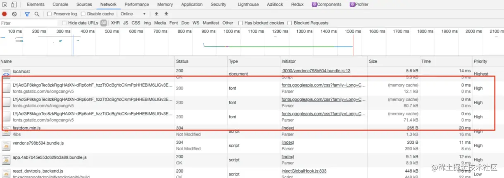
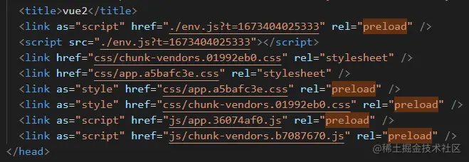
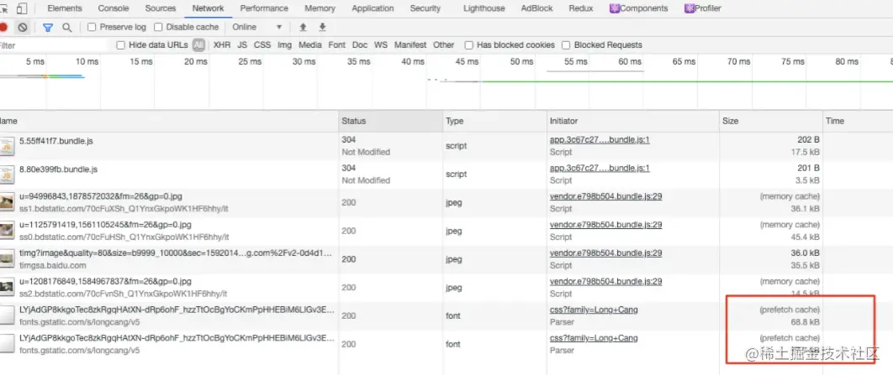

# JS加载的6种方式
## 一、Script标签
### 1.1 正常模式
```html
<script src="index.js"></script>
```
这种情况下 JS 会阻塞DOM渲染，浏览器必须等待 index.js 加载和执行完成后才能去做其它事情。

如果有多个文件，会按照在文档中的顺序依次加载和执行。
### 1.2 async 模式
```html
<script async src="index.js"></script>
```
async 模式下，它的加载是异步的，JS 不会阻塞 DOM 的渲染，async 加载是无顺序的，当它加载结束，JS 会立即执行。
如果有多个标签，它们是并行异步加载的。

使用场景：若该 JS 资源与 DOM 元素没有依赖关系，也不会产生其他资源所需要的数据时，可以使用async 模式，比如埋点统计、广告、不依赖其他脚本的库等。
### 1.3 defer 模式
```html
<script defer src="index.js"></script>
```
defer 模式下，JS 的加载也是异步的，defer 资源会在 DOMContentLoaded 执行之前，并且 defer 是有顺序的加载

如果有多个设置了 defer 的 script 标签存在，则会按照引入的前后顺序执行，即便是后面的 script 资源先返回

所以 defer 可以用来控制 JS 文件的执行顺序，比如 element-ui.js 和 vue.js，因为 element-ui.js 依赖于 vue，所以必须先引入 vue.js，再引入 element-ui.js
```html
<script defer src="vue.js"></script>
<script defer src="element-ui.js"></script>
```
defer 使用场景：一般情况下都可以使用 defer，特别是需要控制资源加载顺序时。
#### 与async的区别
它们都是异步加载的，不同的是：
- 加载时机：async是解析到该标签时，立即发起请求，不阻碍HTML解析。defer则需要在HTML解析完成后，执行。
- 执行顺序问题：async是无序的，执行的顺序主要看谁先加载完，而defaer是有顺序的，按文档里的顺序执行。
#### 与正常模式的区别
它们都是按顺序执行，不同的是：
- 加载时机：defer在HTML解析完成后加载，而正常模式下的标签是立即执行，会阻碍HTML解析。
- 加载模式：正常模式是同步的，defer是异步的
### 1.4 module 模式
```html
<script type="module">import { a } from './a.js'</script>
```
在主流的现代浏览器中，script 标签的属性可以加上 type="module"，浏览器会对其内部的 import 引用发起 HTTP 请求，获取模块内容。这时 script 的行为会像是 defer 一样，在后台下载，并且等待 DOM 解析
Vite 就是利用浏览器支持原生的 es module 模块，开发时跳过打包的过程，提升编译效率
## 二、Link标签
### 2.1 preload
```html
<link rel="preload" as="script" href="index.js">
```
link 标签的 preload 属性：用于提前加载一些需要的依赖，这些资源会优先加载。即：一般情况下，这些资源会优先发出请求，但具体的行为还与浏览器的调度策略有关。如下图：


vue2 项目打包生成的 index.html 文件，会自动给首页所需要的资源，全部添加 preload，实现关键资源的提前加载


preload 特点

- preload 加载的资源是在浏览器渲染机制之前进行处理的，并且不会阻塞 onload 事件；
- preload 加载的 JS 脚本其加载和执行的过程是分离的，即下载后并不会马上执行，在后续代码中显示引用时才会触发。所以，只有在后续有引用的代码才考虑preload，否则会浪费带宽。
- as属性需要赋值，告诉浏览器资源的类型，以让浏览器更好调整优先级。
### 2.2 prefetch
```html
<link rel="prefetch" as="script" href="index.js">
```
prefetch 是利用浏览器的空闲时间，加载页面将来可能用到的资源的一种机制；通常可以用于加载其他页面（非首页）所需要的资源，以便加快后续页面的打开速度


prefetch 特点：
- pretch 加载的资源可以获取非当前页面所需要的资源，并且将其放入缓存至少5分钟（无论资源是否可以缓存）
- 当页面跳转时，未完成的 prefetch 请求不会被中断

#### 与preoad的区别
- 优先级不同：preload是最高优先级，prefech是最低优先级。
- 加载时机：preload是解析后马上加载，prefetch是空闲时加载。
- 执行时机：preload是在后续代码显示引用时执行。prefetch在资源引用时才执行，有可能是下一个页面。

## 三、总结
- async、defer 是 script 标签的专属属性，对于网页中的其他资源，可以通过 link 的 preload、prefetch 属性来预加载
- 如今现代框架已经将 preload、prefetch 添加到打包流程中了，通过灵活的配置，去使用这些预加载功能，同时我们也可以审时度势地向 script 标签添加 async、defer 属性去处理资源，这样可以显著提升性能
